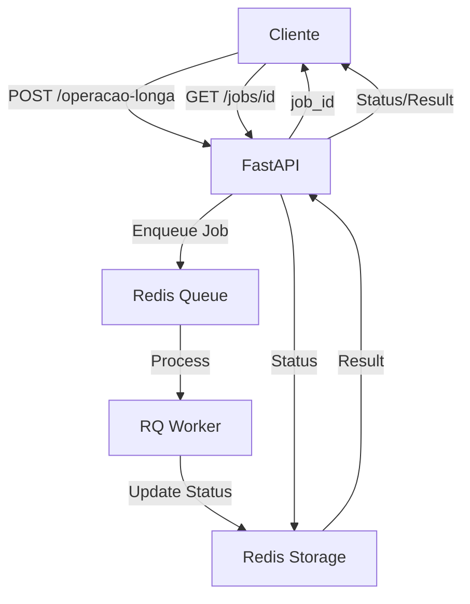

# API de Operações Longas - Questão 2

## 📋 Descrição da Questão

### 🎯 **Comando da Questão (Original)**
> *"You have a REST API under a WAF that limits the maximum request time to 30 seconds and also interrupts application processing after request expiration. There is a certain operation, however, that would demand at least 35 seconds to complete. How would you proceed for your user to be able to retrieve the result of this operation?"*

## 🚀 Solução Implementada

Esta API implementa um **padrão de processamento assíncrono com job queue** usando FastAPI, Redis e RQ (Redis Queue) para atender aos requisitos da questão.

### ✅ **Como a API Atende aos Requisitos**

#### 1. **Resposta Imediata (< 1s)**
- ✅ **POST** `/api/operacao-longa` retorna instantaneamente
- ✅ Retorna `job_id` único para tracking
- ✅ Status inicial `pending`
- ✅ Evita timeout do WAF (30s)

#### 2. **Processamento Assíncrono (35+ segundos)**
- ✅ Jobs executam em **workers background** 
- ✅ Operação padrão: **35 segundos**
- ✅ Operação customizada: **1-300 segundos**
- ✅ Sem limitação de timeout

#### 3. **Polling para Acompanhamento**
- ✅ **GET** `/api/jobs/{job_id}` para consulta
- ✅ Estados claros: `pending` → `processing` → `completed`/`failed`
- ✅ Recomendação: polling a cada **2-5 segundos**

#### 4. **Persistência e Resultados**
- ✅ Jobs armazenados no **Redis** com TTL de 24h
- ✅ Resultado completo retornado após conclusão
- ✅ Timestamps detalhados de cada etapa
- ✅ Tratamento de erros com retry automático

## 📝 Endpoints da API

### 1. **Criar Operação Longa**
```http
POST /api/operacao-longa
Content-Type: application/json

{
  "dados": {
    "parametro1": "valor1",
    "parametro2": 123
  }
}
```

**Resposta (< 1s):**
```json
{
  "job_id": "uuid-gerado",
  "status": "pending",
  "url_status": "/api/jobs/uuid-gerado",
  "mensagem": "Job criado com sucesso. Use a URL de status para acompanhar o progresso."
}
```

### 2. **Operação Customizada**
```http
POST /api/operacao-customizada
Content-Type: application/json

{
  "dados": {
    "parametro": "teste"
  },
  "tempo_processamento": 45
}
```

### 3. **Consultar Status (Polling)**
```http
GET /api/jobs/{job_id}
```

**Resposta Completa:**
```json
{
  "job_id": "uuid",
  "status": "completed",
  "criado_em": "2025-11-14T02:20:14.133615+00:00",
  "iniciado_em": "2025-11-14T02:20:14.156132+00:00", 
  "completado_em": "2025-11-14T02:20:59.158031+00:00",
  "resultado": {
    "dados_processados": {...},
    "status": "sucesso",
    "mensagem": "Operação concluída com sucesso",
    "tempo_processamento": "45s"
  }
}
```

### 4. **Health Check**
```http
GET /api/health
```

## 🏗️ Arquitetura



### **Componentes:**

- **FastAPI**: API REST com validação Pydantic
- **Redis**: Storage de jobs e sistema de filas
- **RQ (Redis Queue)**: Processamento assíncrono
- **Docker**: Containerização e orquestração

## 🚀 Como Executar

### **Docker Compose (Recomendado)**
```bash
# 1. Clonar/acessar o projeto
cd job-queue

# 2. Criar arquivo de ambiente (opcional - já existe .env)
cp .env.example .env  # ou usar o .env existente

# 3. Iniciar todos os serviços (Redis, API, Workers, Dashboard)
docker compose up --build -d

# 4. Verificar se todos os containers estão rodando
docker compose ps

# 5. Ver logs em tempo real
docker compose logs -f

# 6. Testar a API
curl http://localhost:8000/api/health
```


## 📊 Validação dos Requisitos

### ✅ **Teste de Conformidade - Questão 2**

| Requisito | Status | Validação |
|-----------|--------|-----------|
| Resposta < 1s | ✅ | POST retorna em ~100ms |
| Operação 35+s | ✅ | Processamento em 35-45s |
| Evita timeout WAF | ✅ | Job executado em background |
| Polling funcional | ✅ | GET status durante execução |
| Estados claros | ✅ | pending → processing → completed |
| Resultado completo | ✅ | Dados retornados após conclusão |
| Tratamento de erros | ✅ | Status failed + retry automático |

### **Exemplo de Execução Válida:**
```
[00:00] POST /operacao-longa → job_id (< 1s) ✅
[00:02] GET /jobs/id → status: pending ✅  
[00:05] GET /jobs/id → status: processing ✅
[00:40] GET /jobs/id → status: completed ✅
```

## 🌐 URLs Importantes

| Serviço | URL | Descrição |
|---------|-----|-----------|
| **API** | http://localhost:8000 | Endpoints REST |
| **Documentação** | http://localhost:8000/docs | Swagger UI interativo |
| **Health Check** | http://localhost:8000/api/health | Status da API |
| **Dashboard RQ** | http://localhost:9181 | Monitor de jobs |

## 📈 Características Técnicas

### **Tolerância a Falhas**
- ✅ Retry automático (até 3 tentativas)
- ✅ TTL de jobs (24 horas)
- ✅ Graceful shutdown

### **Escalabilidade**
- ✅ Múltiplos workers RQ
- ✅ Arquitetura stateless
- ✅ Jobs independentes
- ✅ Container ready

### **Monitoramento**
- ✅ Logs estruturados
- ✅ Timestamps precisos
- ✅ Dashboard de jobs
- ✅ Métricas de performance